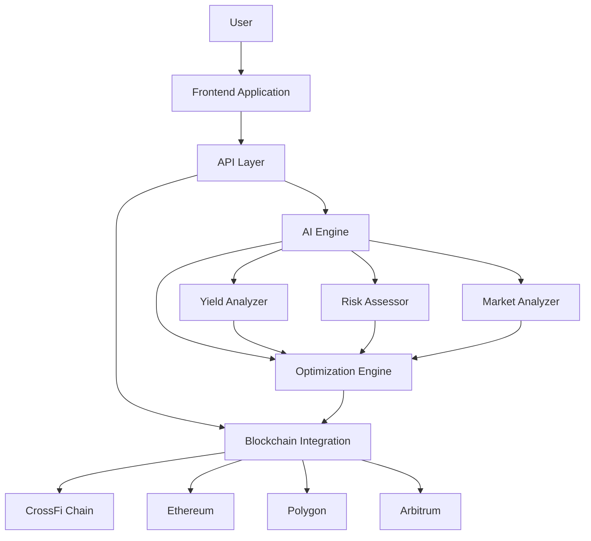
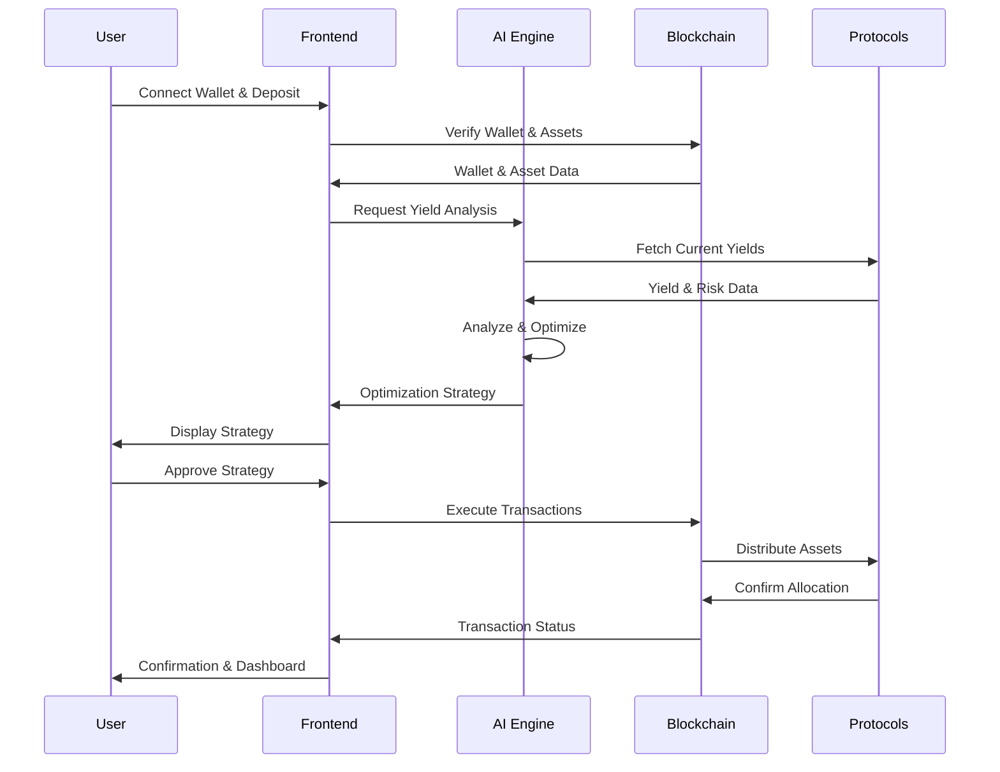
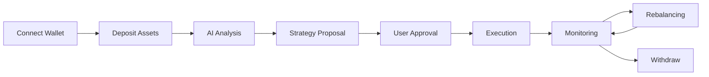
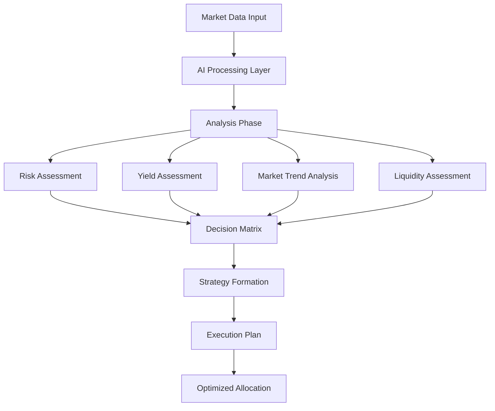

<h1 align="center">
 CrossMeshAI - Cross-Chain Yields. Powered by AI-Agents.
</h1>

 CrossMesh AI is an autonomous yield    optimizer that routes your assets across chains and protocols using real-time strategy powered by Ai-Agents maximizing returns without manual effort.
      

<!-- 

  

 -->

<h3 align="center">
  <a href="https://crossmeshai.vercel.app" target="_blank"> Visit Live Project</a>
</h3>
 

## 🖼️ Demo & Screenshots

  

  <a href="#features">Features</a> •
  <a href="#architecture">Architecture</a> •
  <a href="#tech-stack">Tech Stack</a> •
  <a href="#usage">Usage</a> •
  <a href="#roadmap">Roadmap</a> •
  <a href="#team">Team</a> •
  <a href="#license">License</a>

## 🚀 Project Overview

CrossMeshAI is an autonomous yield optimizer that routes your assets across chains and protocols using real-time strategy powered by AI-Agents, maximizing returns without manual effort. The platform leverages artificial intelligence to analyze market conditions, assess risks, and automatically allocate funds to the highest-yielding protocols across multiple blockchain networks.

Built on the CrossFi blockchain with seamless cross-chain capabilities, CrossMeshAI eliminates the complexity of DeFi yield farming by providing a single interface for managing assets across the entire blockchain ecosystem.

## ✨ Features 

### 🤖 AI-Agent Powered

Advanced AI agents analyze market conditions and automatically route your funds to the highest-yielding protocols. The system continuously monitors yield opportunities, risk factors, and market conditions to make data-driven decisions for optimal returns.

- **Intelligent Strategy Selection**: AI agent analyzes yield data from DefiLlama API, selects the best protocol/chain combo, and provides reasoned recommendations (e.g., "Route to Arbitrum Aave: 6.5% APY, low risk").
- **Predictive Rebalancing**: AI simulates "what-if" scenarios for rebalances, optimizing for maximum returns while minimizing risks like impermanent loss.
- **Risk Assessment**: Evaluates strategies for factors like gas costs, bridge fees, and market risks, generating comprehensive risk scores and reports.
- **Customizable AI Prompts**: Users can input preferences (e.g., "Prioritize low-risk chains"), and the AI refines strategies accordingly.
- **Market Trend Analysis**: Identifies emerging opportunities and potential risks based on historical data and current market conditions.

### 🌐 Cross-Chain Intelligence

Seamlessly operate across multiple blockchain networks with automated cross-chain yield farming strategies. CrossMeshAI integrates with CrossFi, Ethereum, Polygon, Arbitrum, and more, allowing users to access yield opportunities regardless of which blockchain they exist on.

- **Token Deposits**: Deposit $XFI (native CrossFi token) or standard EVM tokens (e.g., USDC, ETH equivalents) into the vault with automatic routing to the highest-yielding protocol across supported chains.
- **Cross-Chain Bridging**: Integrated bridge logic to move assets between chains when needed for optimal yield capture.
- **Chain-Agnostic Interface**: Single dashboard to manage assets across all supported networks without needing to switch networks manually.
- **Gas Optimization**: Intelligent routing that considers gas costs when determining cross-chain transfers to maximize net yields.
- **Multi-Chain Portfolio View**: Unified view of assets across all chains with real-time balances and performance metrics.

### ⚡ Instant Rebalancing

Real-time portfolio rebalancing based on market dynamics and risk assessment for optimal returns. The system automatically adjusts asset allocations as market conditions change, ensuring your portfolio always maintains the best risk-reward ratio.

- **Trigger-Based Rebalancing**: Assets auto-rebalance based on conditions like APY drops, gas fees, or market volatility—triggered by on-chain events or periodic checks.
- **Threshold-Based Execution**: Configurable thresholds for minimum APY differences to trigger rebalancing, avoiding unnecessary transactions.
- **Gas-Aware Timing**: Intelligent timing of rebalances during periods of lower network congestion to minimize transaction costs.
- **Slippage Protection**: Advanced algorithms to minimize slippage during large rebalances across multiple protocols.
- **Partial Rebalancing**: Ability to rebalance only a portion of assets when full rebalancing isn't optimal due to market conditions.

### 🛡️ Risk Management

Built-in risk assessment and protection mechanisms to safeguard your investments across all protocols. Each vault and strategy undergoes rigorous security analysis, with smart contract audits, insurance coverage options, and real-time monitoring for unusual activities.

- **Protocol Risk Scoring**: Comprehensive risk assessment of each integrated protocol based on audit history, TVL, and historical performance.
- **Diversification Strategies**: Automatic diversification of assets across multiple protocols and chains to reduce concentration risk.
- **Insurance Integration**: Optional integration with DeFi insurance protocols to protect against smart contract failures.
- **Circuit Breakers**: Automatic pausing of certain strategies during extreme market volatility or unusual protocol behavior.
- **Real-time Monitoring**: Continuous monitoring of protocol health indicators with automated alerts for potential issues.

### 🪙 $XFI Integration

Deep integration with CrossFi's native $XFI token for enhanced liquidity and governance participation. Token holders receive additional benefits, including reduced fees, higher yields, and voting rights in the protocol's governance system.

- **Fee Discounts**: Reduced platform fees for $XFI holders based on token holdings.
- **Yield Boosting**: Stake $XFI to boost yields on your deposited assets across all supported vaults.
- **Liquidity Mining**: Earn additional $XFI rewards for providing liquidity to specific vaults.
- **Referral Rewards**: Earn $XFI tokens by referring new users to the platform.
- **Priority Access**: Early access to new vaults and features for significant $XFI holders.

### 🏛️ Governance System

Community-driven governance allows $XFI holders to vote on protocol upgrades, fee structures, and new feature implementations. The decentralized governance model ensures that the platform evolves according to user needs and preferences.

- **DAO Voting System**: Users stake $XFI or vault tokens to propose and vote on yield strategies and platform changes.
- **Weighted Voting**: Votes weighted by staked amount, with on-chain execution of approved proposals.
- **Proposal Submission**: User-friendly interface for submitting governance proposals, stored on-chain for transparency.
- **Reward Distribution**: Voters earn $XFI rewards from vault fees or yields for participating in successful strategies.
- **Governance Forums**: Dedicated discussion forums for proposal refinement before formal voting.

### 📊 Analytics Dashboard

Comprehensive analytics provide insights into portfolio performance, yield comparisons, and market trends. Users can track their earnings, monitor asset allocations, and analyze historical performance with intuitive visualizations.

- **Real-Time Metrics Display**: Interactive dashboard showing vault health (total value locked, current APY), cross-chain breakdowns, and rebalance history.
- **User Portfolio Tracking**: Personalized views of deposited assets, yields earned, and AI-recommended actions.
- **Performance Comparisons**: Compare your portfolio performance against benchmarks and other yield strategies.
- **Historical Data Analysis**: Track performance over time with customizable date ranges and metrics.
- **Export Functionality**: Export reports and data for personal record-keeping or tax purposes.
- **AI Insights Panel**: Displays AI-generated reports and recommendations for portfolio optimization.

### 🏦 Vault Management

Specialized vaults with different strategies cater to various risk profiles and investment goals. From conservative stablecoin strategies to aggressive yield farming approaches, CrossMeshAI offers options for every type of investor.

- **Strategy Customization**: Choose from predefined strategies or create custom strategies based on risk tolerance and yield preferences.
- **Auto-Compounding**: Automatic reinvestment of yields to maximize compound returns over time.
- **Flexible Deposits/Withdrawals**: Deposit or withdraw assets at any time with minimal restrictions.
- **Strategy Transparency**: Complete visibility into the current allocation of assets and the reasoning behind each strategy.
- **Risk-Categorized Vaults**: Vaults clearly categorized by risk level (Conservative, Moderate, Aggressive) to match investor profiles.

### 📱 User Experience & Security

- **Multi-Wallet Integration**: Seamless connection via various wallet providers (MetaMask, WalletConnect, Coinbase Wallet, etc.).
- **Mobile Responsiveness**: Fully responsive design optimized for both desktop and mobile devices.
- **Dark/Light Mode**: Customizable interface themes for comfortable viewing in any environment.
- **Notifications System**: Customizable alerts for important events like successful deposits, rebalances, or governance votes.
- **Two-Factor Authentication**: Enhanced security for sensitive operations.
- **Educational Resources**: Built-in guides and tooltips to help users understand complex DeFi concepts.

## 🏗️ Architecture 

### High-Level System Architecture

### Data Flow Architecture

### User Journey Flow

### AI Decision Engine

## 🔧 Tech Stack 

### Frontend

- **Framework**: Next.js 15 (App Router), React 19
- **Styling**: TailwindCSS
- **Animations**: Motion
- **State Management**: TanStack Query, Zustand,
- **Handling & Validation**: React Hook Form, Zod
- **Data Fetching**: SWR for real-time data

### Blockchain Integration

- **Web3 Core**: viem, ethers.js
- **Wallet Connection**: ConnectKit
- **Contract Interaction**: wagmi
- **Cross-Chain Solutions**: Axelar SDK, LayerZero, Wormhole
- **Supported Networks**: CrossFi (Primary), Ethereum, Polygon, Arbitrum, BNB Chain, Optimism, Avalanche
- **Smart Contract Development**: Solidity, Hardhat, Foundry

### Backend & API

- **API Framework**: Next.js API Routes, tRPC
- **Database**: MongoDB, Prisma ORM
- **Caching**: Redis, Vercel Edge Cache

### AI & Analytics

- **AI Integration**: Google Gemini API, OpenAI API
- **Analytics Processing**: TensorFlow.js for client-side predictions
- **Real-time Data**: Server-Sent Events, WebSockets

## Deployment Details

This project is deployed on CrossFi Testnet (Chain ID: 4157).

### Testnet Deployment

- **Deployer Address**: [0xf8124382564d3271c9645Fe394Cc1764FC543030](https://test.xfiscan.com/address/0xf8124382564d3271c9645Fe394Cc1764FC543030)
- **VaultRouter Contract**: [0xfc827fd0fb015b0e2f495755f34151d60ea1c615](https://test.xfiscan.com/address/0xfc827fd0fb015b0e2f495755f34151d60ea1c615)
- **GovernanceDAO Contract**: [0x630f3d2582736ad0c749a13085c7068660c4b498](https://test.xfiscan.com/address/0x630f3d2582736ad0c749a13085c7068660c4b498)

## 🖥️ Usage 

1. **Connect Wallet**: Connect your Web3 wallet (MetaMask, WalletConnect, etc.)
2. **Deposit Assets**: Deposit your tokens into the selected vaults
3. **AI Optimization**: The AI will analyze and optimize your portfolio
4. **Monitor & Manage**: Track your performance and make adjustments as needed

## 🛣️ Roadmap 

- **Q2 2025**: Launch on CrossFi Mainnet
- **Q3 2025**: Add support for additional chains (Aptos,Solana, Base, Blast etc)
- **Q4 2025**: Implement advanced AI prediction models
- **Q1 2026**: Introduce institutional-grade vaults
- **Q2 2026**: Launch iOS & Android App

## 👥 Team 

- **@ImKKingshuk** - Lead Developer & Project Architect

## 📄 License 

This project is licensed under the **GNU General Public License v3.0** - see the [LICENSE](LICENSE) file for details.
